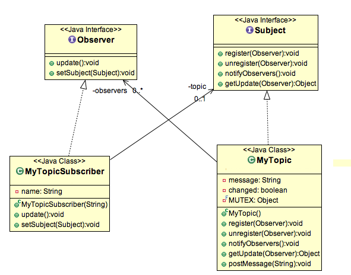

# Observer Pattern

The **Observer Pattern** is a behavioral design pattern. It becomes useful when you are interested in the state of an object and want to be notified whenever there is any change. In the observer pattern, the objects that watch the state of another object are called Observers, and the object being watched is called the Subject.

**Subject** contains a list of observers to notify of any change in its state. Therefore, it should provide methods for observers to register and unregister themselves. The Subject also contains a method to notify all observers of any change. It can either send the update while notifying the observer or provide another method to get the update. 
Observers should have a method to set the object to watch and another method used by the Subject to notify them of any updates. Java provides an inbuilt platform for implementing the Observer pattern through the **java.util.Observable** class and **java.util.Observer** interface. However, it is not widely used due to its simple implementation, and often we don't want to extend a class just for implementing the Observer pattern as Java doesn't support multiple inheritance in classes. 
**Java Message Service (JMS)** uses the Observer design pattern along with the Mediator pattern to allow applications to subscribe and publish data to other applications. **Model-View-Controller (MVC)** frameworks also use the Observer pattern where the Model is the Subject, and Views are Observers that can register to get notified of any changes to the model. 
For our observer pattern java program example, we would implement a simple topic and observers can register to this topic. Whenever any new message will be posted to the topic, all the registers observers will be notified and they can consume the message.

