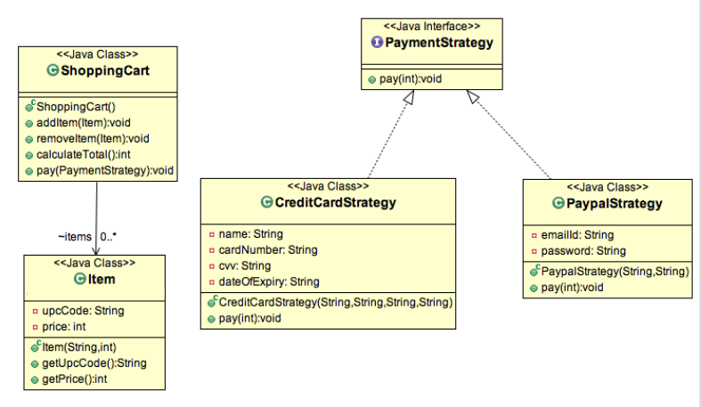

# Strategy pattern
**Strategy pattern** is also known as Policy Pattern. We define multiple algorithms and let client application pass the algorithm to be used as a parameter. One of the best example of strategy pattern is Collections.sort() method that takes Comparator parameter. Based on the different implementations of Comparator interfaces, the Objects are getting sorted in different ways. For our example, we will try to implement a simple Shopping Cart where we have two payment strategies - using Credit Card or using PayPal.

