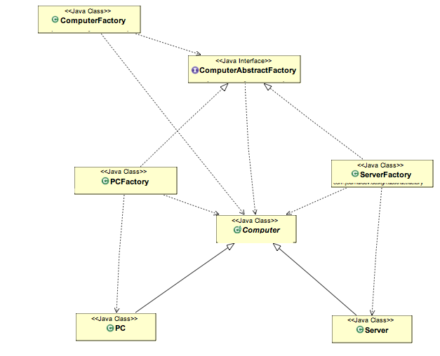

# Abstract Factory Pattern

If you are familiar with factory design pattern in java, you will notice that we have a single Factory class. This factory class returns different subclasses based on the input provided and factory class uses if-else or switch statement to achieve this. In the Abstract Factory pattern, we get rid of if-else block and have a factory class for each sub-class. Then an Abstract Factory class that will return the sub-class based on the input factory class. 
#### Abstract Factory Design Pattern Benefits:
- Abstract Factory design pattern provides approach to code for interface rather than implementation.
- Abstract Factory pattern is “factory of factories” and can be easily extended to accommodate more products.
- Abstract Factory pattern is robust and avoid conditional logic of Factory pattern.

This is the example that I implemented:

