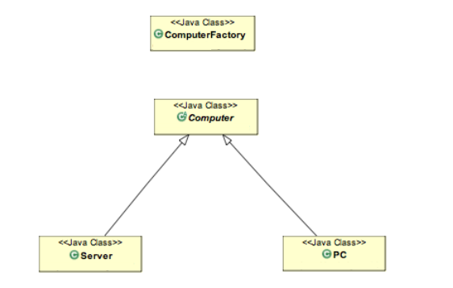

# Factory Pattern

**The factory design pattern** is used when we have a superclass with multiple sub-classes and based on input, we need to return one of the sub-class. This pattern takes out the responsibility of the instantiation of a class from the client program to the factory class.
Super class in factory design pattern can be an interface, abstract class or a normal java class. 
Some important points about Factory Design Pattern method are:
- We can keep Factory class Singleton or we can keep the method that returns the subclass as static.
- Notice that based on the input parameter, different subclass is created and returned. 

#### Factory Design Pattern Advantages:
- Factory design pattern provides approach to code for interface rather than implementation.
- Factory pattern removes the instantiation of actual implementation classes from client code. Factory pattern makes our code more robust, less coupled and easy to extend.
- Factory pattern provides abstraction between implementation and client classes through inheritance.

For our factory pattern java program example, we have a superclass called Computer and two subclasses: PC and Server.

