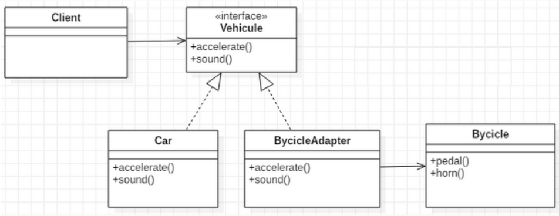

# Adapter Pattern
Adapter design pattern is one of the **structural design pattern** and its used so that two unrelated interfaces can work together. The object that joins these unrelated interface is called an **Adapter**. 
### Two Way Adapter Pattern:

While implementing Adapter pattern, there are two approaches - class adapter and object adapter - however both these approaches produce same result.
- **Class Adapter** - This form uses java inheritance and extends the source interface, in our case Socket class.
- **Object Adapter** - This form uses Java Composition and adapter contains the source object.

In my example, I will implement an Object Adapter. Here is the class diagram for my implementation:

