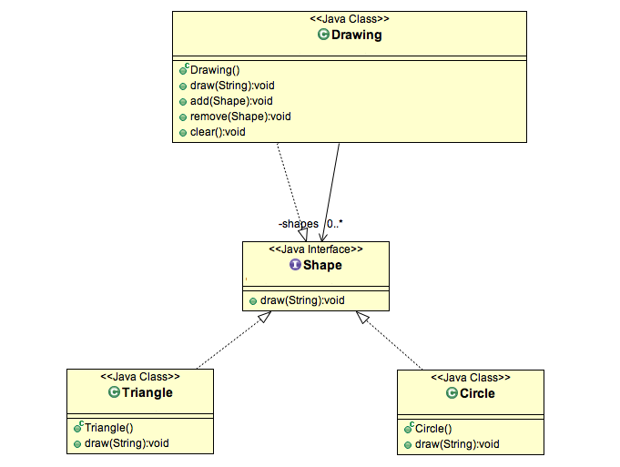

# Composite Pattern
Composite pattern is one of the **Structural design pattern**. Composite design pattern is used when we have to represent a part-whole hierarchy. 

When we need to create a structure in a way that the objects in the structure has to be treated the same way, we can apply composite design pattern. Lets understand it with a real life example - A diagram is a structure that consists of Objects such as Circle, Lines, Triangle etc. When we fill the drawing with color (say Red), the same color also gets applied to the Objects in the drawing. Here drawing is made up of different parts and they all have same operations. Composite Pattern consists of following objects.

- **Base Component** - Base component is the interface for all objects in the composition, client program uses base component to work with the objects in the composition. It can be an interface or an abstract class with some methods common to all the objects.
- **Leaf** - Defines the behaviour for the elements in the composition. It is the building block for the composition and implements base component. It doesn’t have references to other Components.
- **Composite** - It consists of leaf elements and implements the operations in base component.

Here I am applying composite design pattern for the drawing scenario:

